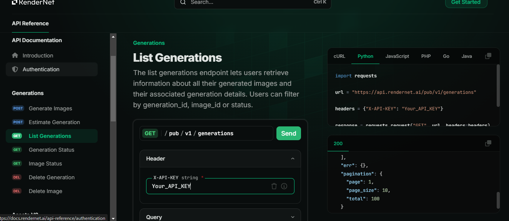
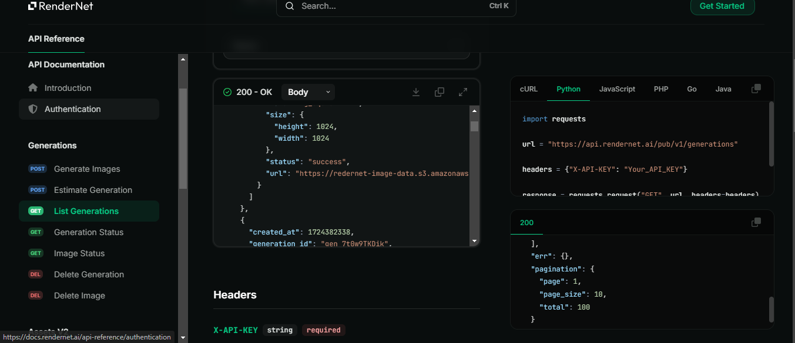

### Detailed Documentation for the Flask Application

#### 1. **Setup and Dependencies**
   - **Flask**: Framework for handling routes and web logic.
   - **Flask-MySQLdb**: Connects the application to a MySQL database.
   - **Stripe**: Manages payments within the application.
   - **Other Modules**: `PIL` for image handling, `requests` for making HTTP requests, and `os`, `time`, and `random` for additional functionalities.

### Installation 

   ```bash
pip install flask flask-mysqldb requests pillow stripe
```

#### 2. **Main Routes**
   - **`/`**: Main page showing the user's remaining credits.
   - **`/login` and `/register`**: Routes for logging in and registering.
   - **`/generate`**: Allows users to generate images using an external API (Rendernet).
   - **`/buy_credits` and `/purchase_credits`**: Manage credit purchases using Stripe.
   - **`/payment_success`**: Updates the user's credits after a successful purchase.

#### 3. **Credit Management**
   - **Credit Validation**: Before generating an image, it checks if the user has available credits.
   - **Credit Update**: After image generation or credit purchase, the database is updated.

#### 4. **Stripe Integration**
   - **`purchase_credits`**: Creates a payment session in Stripe and redirects the user to the payment page.
   - **`payment_success`**: Updates the user's credits after a successful purchase and redirects them to the confirmation page.

#### 5. **Image Handling**
   - **Image Upload and Processing**: Users can upload images (e.g., for FaceLock), which are processed and sent to the Rendernet API to generate new images.

#### 6. **Security**
   - **Session Management**: Ensures that only authenticated users can access functions like image generation and credit purchases.
   - **Secure Storage**: The Stripe secret key and other sensitive configurations are stored securely.

#### 7. **Other Features**
   - **Dynamically Generated Prompts**: Based on the user's gender, personalized prompts are generated for LinkedIn or Instagram.
   - **Daily Limit Control**: Implements a limit on image generations every 24 hours.

### 8. **Obtaining and Configuring RenderNet APIs**
   - **API Key Configuration and Image Download:** Go to the function `@app.route('/generate', methods=['POST'])` and modify `api_key = 'Your_API_Key'` to your RenderNet API key.

   **Launch the App in Development Mode:** Modify the last line to `app.run(debug=True, host='0.0.0.0', port=5000)` and test generation. You will encounter an error, but the important thing is that it sends the request to the RenderNet server.

   **Obtain `user_id` from RenderNet Server:** After sending the request, go to [List Generations](https://docs.rendernet.ai/api-reference/endpoint/generations/list_generations). You should see a page like this; put your API Key in the Header and click Send. You should see the generation you sent to the server.

   

   **Search for the `url` field here**
   

   From this field, copy the `usr_jFREal2mBT` from the URL `https://rendernet-image-data.s3.amazonaws.com/prod/user_generated/usr_jFREal2mBT/img_0qCkaxZ79t.png` (in your case, it will be different).

   After copying the `user_id`, paste it here where it says `user_id` in this line, to correctly obtain each generated image: `image_url = f"https://rendernet-image-data.s3.amazonaws.com/prod/user_generated/user_id/{image_id}.png"`

### **After these adjustments, you can proceed to deploy for production :b**

### Deploying to Production

#### 1. **Installation and Configuration**
##### 1.1. **Prerequisites**
- Python 3.x
- MySQL
- Nginx (for production)
- Pip to install dependencies

##### 1.2. **Install Dependencies**
```bash
pip install flask flask-mysqldb requests pillow stripe
```

##### 1.3. **Database Configuration**
Create a MySQL database with the following script; you can change the database name if `infinityca` does not suit you:

```sql
CREATE DATABASE infinityca;
USE infinityca;

CREATE TABLE users (
    id INT AUTO_INCREMENT PRIMARY KEY,
    name VARCHAR(100),
    email VARCHAR(100),
    pno VARCHAR(20),
    password VARCHAR(100),
    user_id VARCHAR(10) UNIQUE,
    last_generation_date DATETIME,
    image_generations_remaining INT DEFAULT 5,
    gender VARCHAR(10)
);
```

#### 2. **Production Deployment**
##### 2.1. **Nginx Configuration**
Configure Nginx as a reverse proxy for your Flask application.

```nginx
server {
    listen 80;
    server_name your_domain_or_IP;

    location / {
        proxy_pass http://127.0.0.1:5000;
        include proxy_params;
        proxy_set_header Host $host;
        proxy_set_header X-Real-IP $remote_addr;
    }
}
```

##### 2.2. **Start the Application**
Use `gunicorn` to run the application in production:

```bash
gunicorn --workers 3 app:app
```

#### 3. **Maintenance and Security**
- **Security**: Ensure API key configurations are secure.
- **SSL**: Configure an SSL certificate in Nginx to secure connections.

---